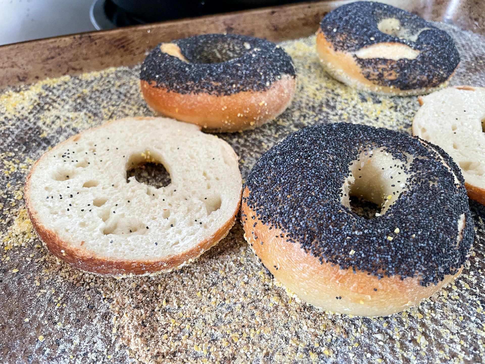
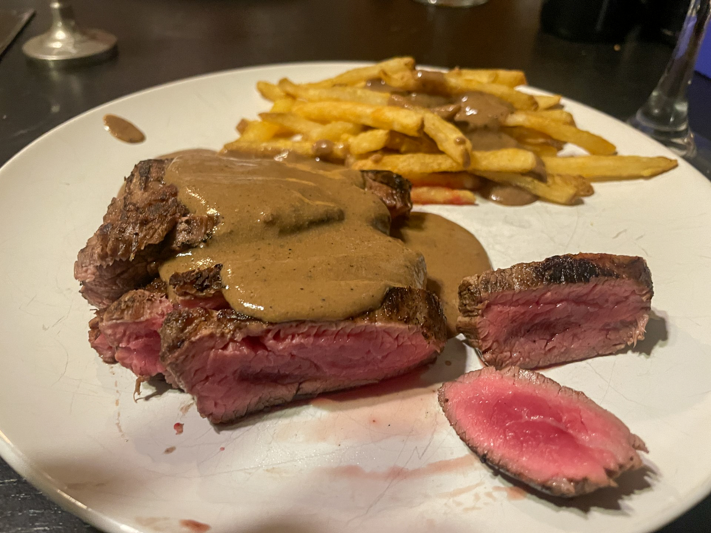

# Family Recipes

Git is an awesome way to organize family recipes, which have largely been institutional knowledge (at least in my family). This allows them to be shared, commented on and updated with better notes as I cook them more.

## What Recipes Are Here
A recipe will be put in the `main` branch when it has been tested and finished. Else, look in other branches for recipes that are in progress. 

## Picture Table Of Contents
(Photos added as recipes are cooked and documented)  

### Bagels

### Medium Rare Sauce

